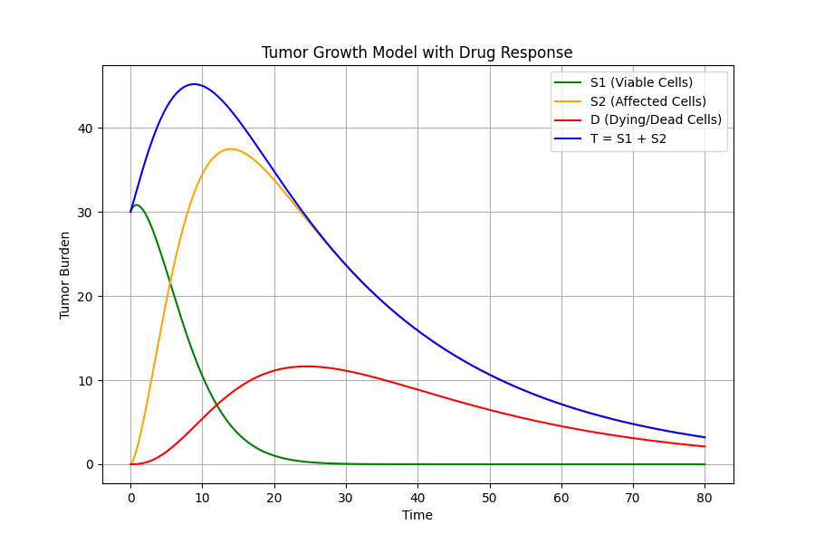
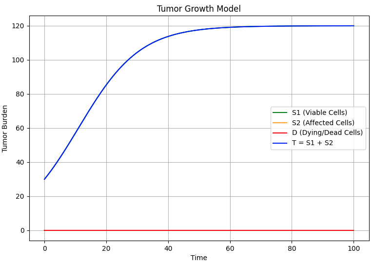
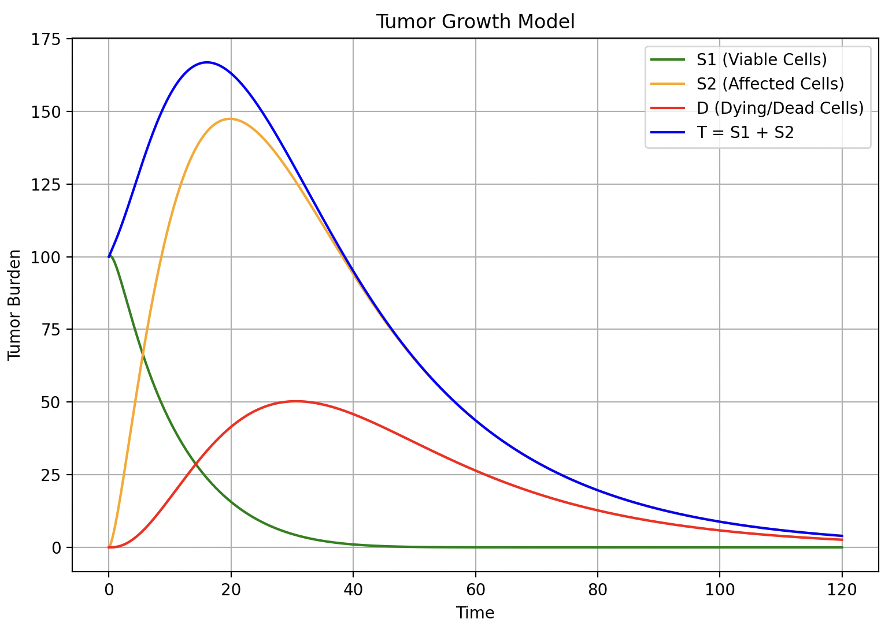
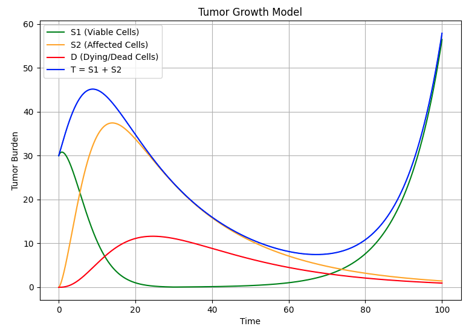

# Tumor Growth Model

## Overview 📌
This project implements a mathematical tumor growth and treatment response model using
ordinary differential equations (ODEs). It simulates how tumor cells grow, respond to
chemotherapy, and are cleared over time, following models commonly used in oncology
and pharmacometrics.

The model is implemented in C++ and solved numerically using a fourth order
Runge Kutta (RK4) method, with results visualized directly from C++ using the [matplotlib-cpp](https://github.com/lava/matplotlib-cpp) library.

The main reference study for this project can be found [here](https://pmc.ncbi.nlm.nih.gov/articles/PMC6813171/).

For the full system of ODE's and breakdown of the project, refer to [Report.pdf](Report.pdf)

## Model Structure 🧬 
The tumor is modeled as a three phase system:

- S1 represents viable tumor cells that grow according to a chosen growth function.
- S2 represents tumor cells affected by the drug, capturing the delay between exposure
  and cell death.
- D represents dying or dead cells that are gradually cleared from the system.

The total tumor size is defined as:

T = S1 + S2

Tumor growth can be modeled using either exponential growth or logistic growth with a
carrying capacity to reflect biological limits. 

## Drug Exposure 🧪
Drug effect is modeled through a time dependent exposure term based on Hill’s equation.

This allows simulation of realistic treatment dynamics, including increasing exposure
over time, constant exposure, or treatment cut off scenarios.

Key parameters include the tumor growth rate, drug kill coefficient, maximum exposure,
and dead cell clearance rate.

## Numerical Method 🧮
The system of ODEs is solved using the fourth order Runge Kutta method.

RK4 provides a stable and accurate approach for integrating nonlinear biological models
while remaining computationally efficient.

## Experiments & Plots 📊
The model is evaluated under multiple conditions

### Tumor Growth Without Treatment

### Increased Growth Rate

### Treatment Cut Off and Regrowth

## License
This project is licensed under the MIT License.
